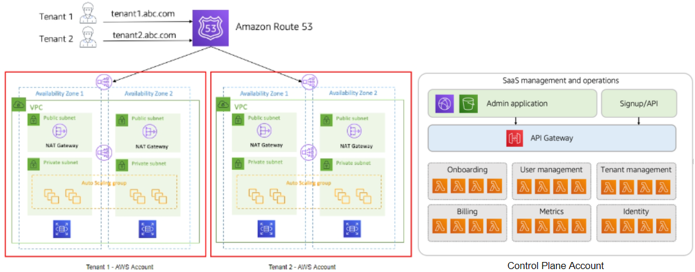

       

### Core Concept
* In this full stack silo pattern, we’re placing all the resources of a given tenant in a separate account. This means that your onboarding process and operational experience will need to provision and configure a new account.

### Key Considerations
* While you can automate aspects of each tenant accounts, there are some aspects of account configuration that cannot be achieved through automation. Account limits are amongst this list and represent a key area you’ll want to consider as you look at what limits will need to be adjusted for each new tenant account.
* AWS Control Tower provides tools for orchestrating the provisioning and configuration of accounts. It provides mechanisms that can simplify this deployment and introduce guardrails that may enhance the overall security and isolation footprint of your SaaS offering.
* While siloing resources, tenants are not allowed to run separate versions of the product. The operational experience here inherits the job of providing a single pane of glass that can provide an aggregated view of all tenant environments. Application deployments will send all deployment data to all tenants.
* The control plane of your SaaS environment will need access to all tenant accounts. This means you’ll need to configure and enable cross-account access, opening up paths for your control plane to deploy, operate, and manage tenant environments.
* Any account-per-tenant model needs to consider the overall scaling profile of your SaaS environment. The number of tenants may exceed account limits, for example. Also, managing and operating large numbers of tenants in an account-per-tenant model can be challenging as it would require significant operations overhead. Aggregation of operational data, deployments, and a host of other areas get more complex in environments with a large number of tenant accounts.

### References
<a href="https://aws.amazon.com/blogs/mt/managing-the-account-lifecycle-in-account-per-tenant-saas-environments-on-aws/" target="_blank">Managing the Account Lifecycle in account per tenant SaaS Environments on AWS</a>

<a href="https://d1.awsstatic.com/whitepapers/saas-tenant-isolation-strategies.pdf" target="_blank">SaaS Tenant Isolation Strategies</a>
