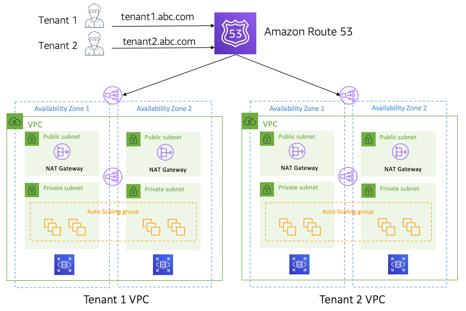

       

### Core Concept   
* The idea of full stack silo is that all of the infrastructure for a tenant is deployed in a single, self-contained construct. Silo models are used for a variety of reasons. Some rely on a silo based on compliance considerations. Others may choose silo based on noisy neighbor, legacy migration, or a host of other consideration. This model can have some adverse effects on the cost, operational, and agility efficiency of a SaaS environment.   
 

### Key Considerations   
* Silo is every bit as valid as any SaaS model that may share infrastructure. The key here is determining whether silo aligns with the needs of your customers or the state of your current application. Some teams that are migrating rely on this model as the starting point for lifting and shifting monolithic legacy applications into a SaaS model where the siloed nature of this model make it easier. The distributed/dedicate nature of this model does introduce operational complexity and can impact the cost efficiency of your offering. In some cases, you may choose to offer silo to a select set of “premium” tier tenants as a way to differentiate the experience of your SaaS solution.
* Even though each tenant has separate resources in a full stack silo model, these siloes will still be managed and operated collectively. When new features are released they are released to all of the tenants. Tenants are never allowed to run one-off versions or be deployed independently. This would undermine the value proposition of SaaS and move more toward a managed service model.
* That siloed nature of this model make the calculation of cost-per-tenant analytics much simpler. Here you can use tagging and other out-of-the-box AWS cost attribution constructs to profile the costs of each tenant silo.
* Siloes are inherently less cost efficient that pooled models. Even with auto-scaling and other mechanisms in place, you’re likely to have some static and/or under-consumed resources—especially when a tenant is idle.
* As you silo infrastructure, you must consider how you will route tenant workloads to specific tenant siloes. Each technology stack may support a variety of routing constructs. You’ll need to identify a model for observing tenant context and using that context to route requests to the appropriate tenant silo.
* Siloed environments generally have more complex deployment footprints. Your DevOps model will need to consider how it rolls out new features across the collection of tenant siloes.
* While the resources of a siloed SaaS environment are not shared by tenants, this does not mean that you’re solution is not multi-tenant. If a silo manages, operates, onboards, and deploys all tenants with the same experience, then this is still a multi-tenant SaaS environment. It can still benefit from the same agility and operational efficiency that is part of SaaS.   

### References
[AWS re:Invent 2019: SaaS tenant isolation patterns](https://www.youtube.com/watch?v=fuDZq-EspNA)

