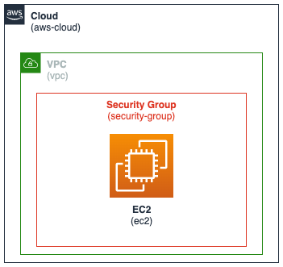

<p align="center">
       
</p>

### Core Concept
* Describe the concept at a high level

### Key Considerations
* List various considerations for this pattern
* Limitations
* Advantages
* Typical use cases

### Code Example
```yaml
AWSTemplateFormatVersion: '2010-09-09'
Transform: AWS::Serverless-2016-10-31
Description: >
    sam-app
    Sample SAM Template for sam-app

Globals:
    Function:
        Timeout: 20
        MemorySize: 512
        Environment:
          Variables:
            TABLE_NAME: !Ref DemoTable
            ENDPOINT_OVERRIDE: ""

Resources:
  GetDemoFunction:
    Type: AWS::Serverless::Function
    Properties:
      CodeUri: target/aws-sam-java-rest-1.0.0.jar
      Handler: com.amazonaws.handler.DemoHandler::handleRequest
      Runtime: java8
      Policies:
        - DynamoDBReadPolicy:
            TableName: !Ref DemoTable
      Events:
        GetDemo:
          Type: Api
          Properties:
            Path: /demo/{demo_id}
            Method: get
```   

**Code sample**
```javascript
function demo(input) {
    console.log(input);
}
```   

### References
<a href="https://aws.amazon.com" target="_blank">Example Reference 1</a>

<a href="https://aws.amazon.com" target="_blank">Example Reference 2</a>


